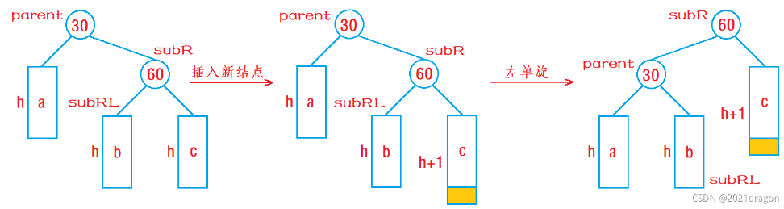
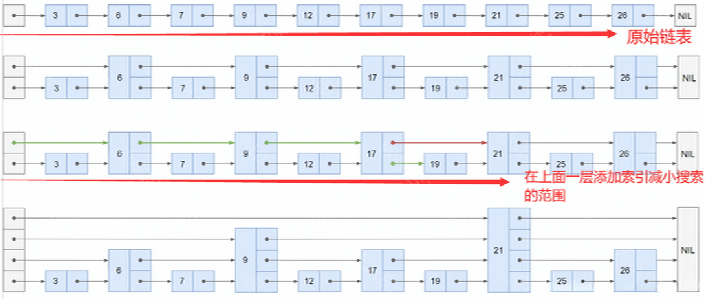

# redis with c/c++

- 使用socket创建TCP连接，实现服务端和客户端通信。
- 构建回声服务器，处理建立新连接、进行状态机读写以及协议解析。
- 序列化命令列表，实现多个命令功能，如get，set，del等。
- 实现链式存储hashtable，用于存储kv值。
- 使用avl树和哈希表实现有序集合，实现功能zadd，zrem，zquery，zscore。
- 使用链表和最小堆实现定时器，链表存储连接有效时间，堆存储缓存有效时间。
- 使用线程池，异步处理过大有序集合的删除操作。

**hashtable**：

使用链式存储，每个索引插入新的数据在链表首。

使用HNV-1a算法对字符串运算后得到hash码，与掩码&得到hash值索引。

两个hash表，大小都为2的幂（这样才能相与得到索引），ht1大小为ht2的两倍，在每次插入运算时，将ht2的数据向ht1移动。若检测到负载因子（所有数据/哈希表大小）超过规定值且ht2为空，则将ht1与ht2指针交换，ht2变为之前ht1，ht1重新初始化为之前两倍。

时间复杂度：插入，查找，删除都为O(1)。但是最坏情况下，所有数据都在同一个索引上（哈希冲突），时间复杂度为O(n)。

**avl树**：

函数`avl_offset`接受两个参数：`node`是当前节点的指针，`offset`是相对于当前节点的偏移量。偏移量可以是正数或负数，表示在树中向前或向后移动的步数。

函数的主要逻辑如下：

1. 初始化变量`pos`为0，表示当前位置相对于起始节点的偏移量。
2. 进入一个循环，直到找到目标节点（即`offset`等于`pos`）。
3. 在循环中，首先检查目标节点是否在当前节点的右子树中。如果`pos`小于`offset`且`pos`加上右子树的节点数大于等于`offset`，则说明目标节点在右子树中。此时，将当前节点移动到右子节点，并更新`pos`的值为`pos`加上左子树的节点数再加1。
4. 如果目标节点不在右子树中，则检查目标节点是否在当前节点的左子树中。如果`pos`大于`offset`且`pos`减去左子树的节点数小于等于`offset`，则说明目标节点在左子树中。此时，将当前节点移动到左子节点，并更新`pos`的值为`pos`减去右子树的节点数再加1。
5. 如果目标节点既不在右子树中也不在左子树中，则说明目标节点不在当前子树中。此时，将当前节点移动到父节点，并根据当前节点是父节点的左子节点还是右子节点来更新`pos`的值。如果当前节点是父节点的右子节点，则`pos`减去左子树的节点数再加1；如果当前节点是父节点的左子节点，则`pos`加上右子树的节点数再加1。
6. 重复步骤3-5，直到找到目标节点或到达根节点。
7. 如果到达根节点且仍未找到目标节点，则返回`NULL`。
8. 如果找到目标节点，则返回该节点的指针。

时间复杂度：总为O(logn)。因为树高度为logn。

**zset**：

由哈希表和avl树组成，每个哈希表的索引不是链表指针，而是avl树指针。

根据score创建avl树。

时间复杂度：插入，删除都为O(logn)。查找为O(1)。范围查找为O(logn + k)。k为查找的元素个数。

**堆**：（为什么不用链表：处理大量数据时难以快速找到最近时间）

总是完全二叉树，即一层装满再存储下一层。

在二叉树中，若当前节点的下标为 i， 则其父节点的下标为 i/2，其左子节点的下标为 i * 2，其右子节点的下标为i * 2+1。

插入：新元素被添加到堆中时，会被放置在数组的末尾，然后通过上浮操作（heap_up）来维护堆的性质。

删除：当从堆中删除元素时，通常的做法是用数组的最后一个元素来替换被删除的元素，然后通过下沉操作（heap_down）来维护堆的性质。

时间复杂度：插入，删除都为O(1) ~ O(logn)。最好直接查找到，最差需要遍历树。

**跳表**：

从顶层链表的首元素开始，从左往右搜索，直至找到一个大于或等于目标的元素，或者到达当前层链表的尾部
如果该元素等于目标元素，则表明该元素已被找到
如果该元素大于目标元素或已到达链表的尾部，则退回到当前层的前一个元素，然后转入下一层进行搜索

时间复杂度：查找，删除，插入都是O(logn)。

